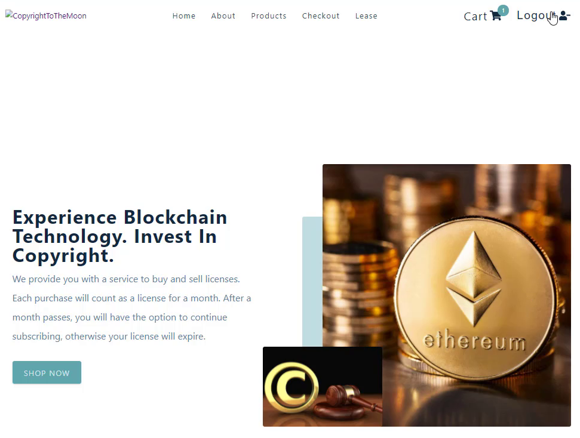
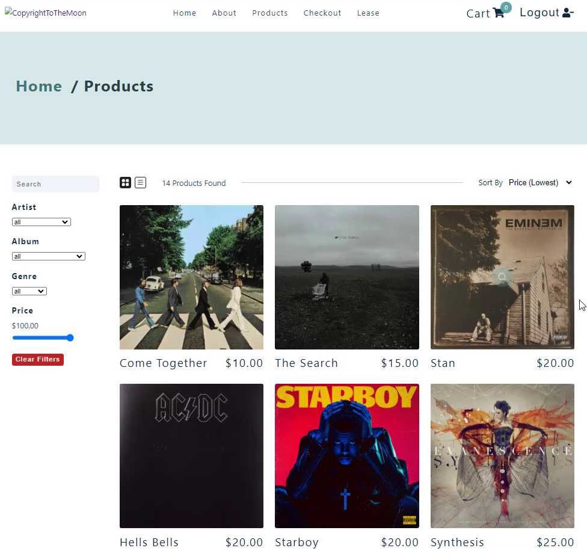
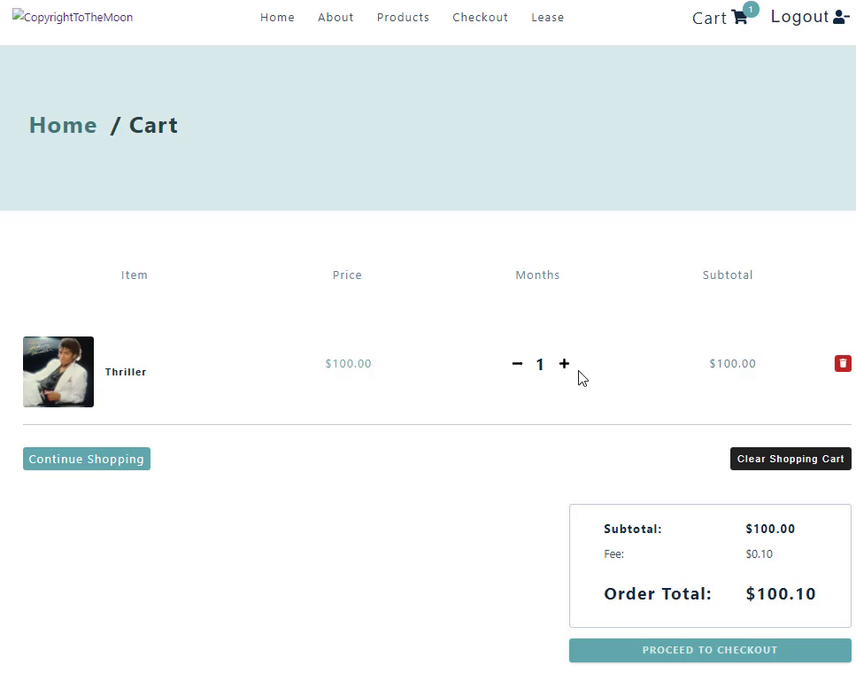
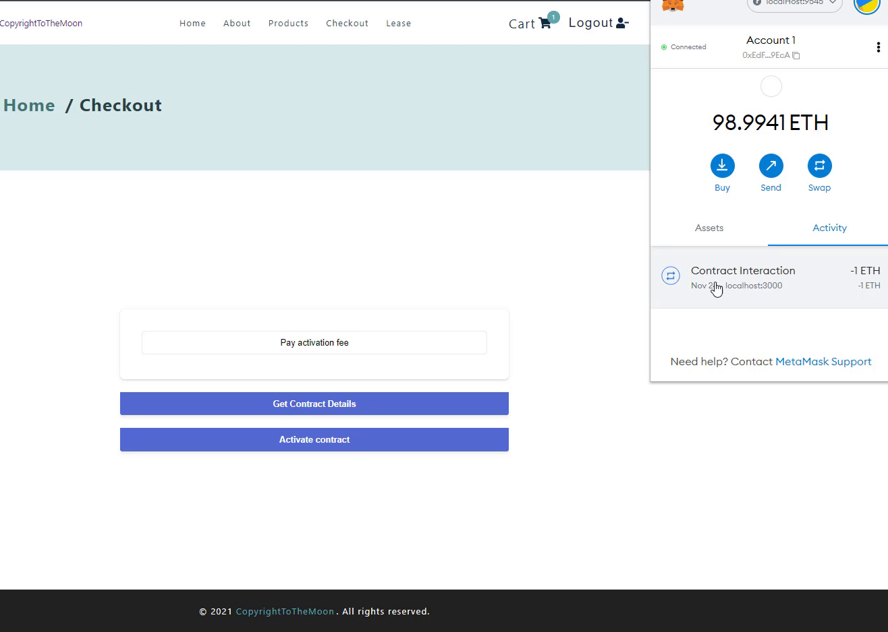
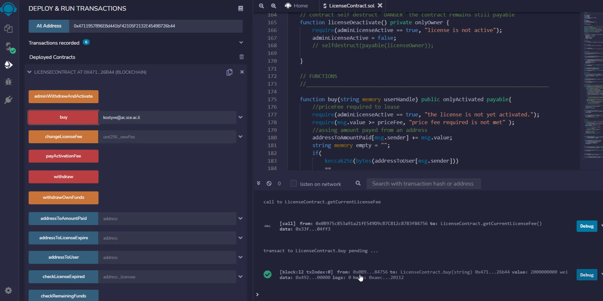

# CopyrightToTheMoon
**Grad. project for college, used with the API [serverlessapi](https://github.com/KostyaVarenye/temp-serverless-function)**
***
# Purpose:
  I've developed this website as a demo for copyright owners so that they will be able to create smart contract licenses on the blockchain and get paid in *Ethereum*.
And to act as e-commerce market for content creators, who would like to purchase licenses with crypto and be backed by blockchain technology.
To sum it up; I wanted to pioneer a new way of creating *legal* smart contracts which binds the two parties in the blockchain.
***
## What i learned:
  Pretty much everything was a new experience for me as before this project I had minimal exposure to front end development.
## What ive used:
  - ReactJS - website development.
  - NodeJS - API serverless functions.
  - Netlify - deployment of serverless functions.
  - Html.
  - CSS.
  - Solidity - for smart contract development.
  - Web3js - communication with blockchain and smart contract.
  - Formspree - just for fun.
  - axios - sending post/get requests for API.
  - Airtable - DB for licenses metadata storage.
  - Truffle suite - for local blockchain and testing/debugging smart contracts.
  - Auth0 - for easy authentication service.
  - MetaMask - crypto wallet.
  - Remix.ethereum - IDE for development of the smart contract.
***
# Demo video (in Hebrew)
[Download from Google Drive](https://drive.google.com/file/d/1zjDeg9Xke6SSNoNC4rmtzM6aRGImrwKk/view?usp=sharing)
***
# Developed architecture:

***
# Showcase:
## Homepage

***
## Products

***
## Cart

***
## Metamask wallet test

***
## Remix IDE

